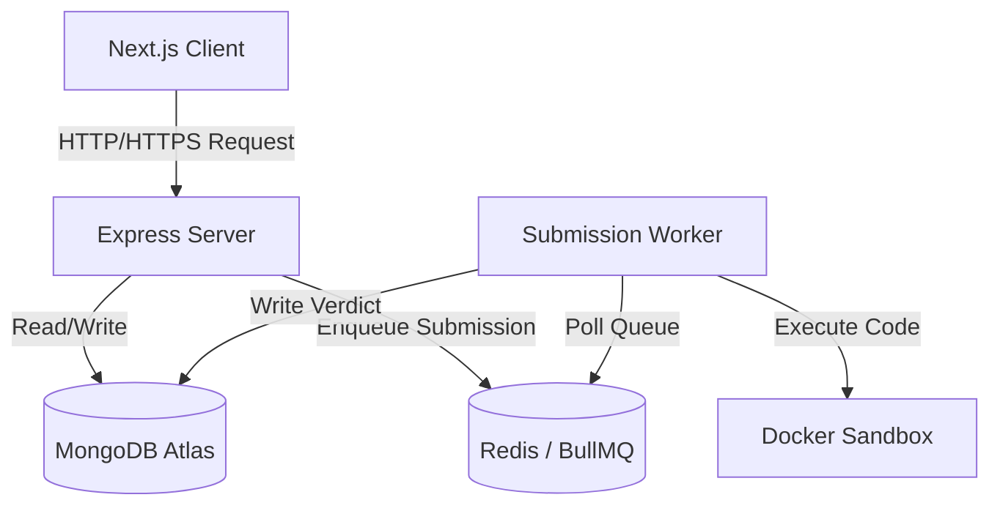
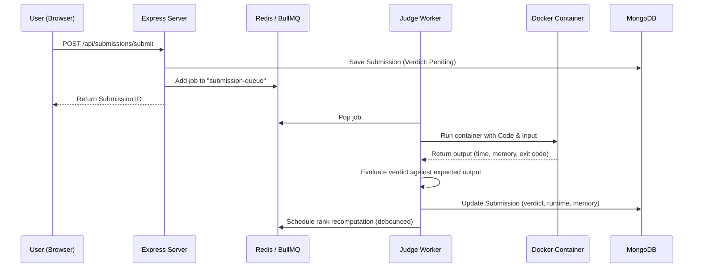

# 📐 CodeWizard System Architecture

CodeWizard is an online coding judge and practice platform designed for scalability, security, and high performance. The platform allows users to solve algorithmic problems, join programming contests, and interact with AI-driven assistants for hints, code reviews, and debugging.

## 🧱 Component Breakdown

### 1. Frontend Client (`/client`)
- **Framework:** Next.js (App Router, dynamic client rendering).
- **Styling:** Tailwind CSS.
- **State & Routing:** Standard React state hook management, client-side routing, and `<Suspense>` wrappers on all query-param dependent components to allow clean static builds.
- **Environment Variables:** Injected at build time via `ARG` and `ENV` parameters in `client/Dockerfile`.
- **Auth:** Cookies-based session management (`httpOnly`, `secure`, `sameSite: strict`). Tokens are encrypted and sent securely to prevent XSS-based token extraction.

### 2. Backend Server (`/server`)
- **Framework:** Node.js + Express.js (v5 compatible).
- **CORS Options Preflight Routing:** Implements RegExp-based wildcard options matcher `app.options(/.*/, ...)` to maintain path-to-regexp v8 compatibility.
- **Security Middleware:** CORS (strict origin matching), Helmet (security headers), and Rate Limiting (powered by `express-rate-limit` using a Redis store).
- **Database:** MongoDB + Mongoose. Auto-indexing is disabled in production to maximize performance, utilizing robust pooling (10 max, 2 min).
- **Authentication:** Custom JWT-based user, employee, and admin roles. Passwords hashed using bcrypt and peppered using a secure cryptographic pepper value loaded from the environment.
- **Logging:** Structured JSON logs via `pino` with automated redaction of sensitive keys (`password`, `token`, `newPassword`).

### 3. Submission Queue & Worker (`/server/workers`)
- **Queue System:** Redis + BullMQ.
- **Offline Connection Resilience:** Configured with `enableOfflineQueue: true` across all Redis clients (`server.js`, `middleware/rateLimit.js`, `libs/ranking.js`) to prevent boot-time crashes if Redis is temporarily unreachable.
- **Concurrency:** Configurable via environment (`WORKER_CONCURRENCY`, defaults to 5).
- **Worker Lifecycle:**
  1. Polls Redis for pending submissions.
  2. Spawns isolated Docker containers using the judge image.
  3. Feeds user code and test cases into the container.
  4. Collects and parses container outputs (stdout, stderr, execution time, and memory usage).
  5. Computes the final verdict (`Accepted`, `Wrong Answer`, `Time Limit Exceeded`, `Runtime Error`, `Compilation Error`).
  6. Saves results to MongoDB and schedules a debounced user ranking recomputation.

### 4. Code Execution Sandbox (`/server/docker`)
- **Isolation:** Users' code runs inside lightweight Alpine-based container sandboxes.
- **Resource Constraints:** Containers run with:
  - Non-root user (`appuser`).
  - Read-only root filesystem (`--read-only`).
  - Strict RAM limitations (e.g., 256MB).
  - CPU quotas to prevent runaway loops from crashing the host.
  - `--tmpfs /tmp:rw,noexec,nosuid` mount to prevent binary executions from `/tmp`.
  - Disabled networking (`--network none`) to block data exfiltration.
- **Supported Languages:** C, C++, Python, Java, and JavaScript.

---

## 🔄 Sequence: Submission Execution Flow

